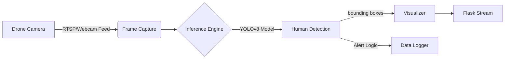

# Building a Drone-Based Intruder Detection System with YOLOv8


Aerial surveillance is transforming modern security, offering dynamic viewpoints that fixed cameras simply cannot match. In this project, I engineered a **Drone-Based Intruder Detection System** powered by **YOLOv8**—a state-of-the-art object detection model—capable of identifying human intruders in real-time from a moving aerial feed.

The core challenge? **Latency.** Processing high-resolution drone footage while maintaining a stable frame rate required a highly optimized pipeline.

---

## The Engineering Challenge

Traditional ground-based surveillance has blind spots. Drones solve this but introduce new complexity:
*   **Motion Blur & Jitter**: The camera is never perfectly still.
*   **Variable Altitudes**: Humans look different from 10m vs 50m.
*   **Processing Constraints**: Inference must happen faster than the video feed to avoid lag.

My goal was to build a system that could **stream, detect, and alert** with sub-second latency.

---

## System Architecture

The solution uses a **Producer-Consumer architecture** to decouple video streaming from heavy ML inference.



### Tech Stack
*   **Model**: YOLOv8 Nano (optimized for speed)
*   **Framework**: PyTorch & Ultralytics
*   **Backend**: Flask (Python) for streaming
*   **Vision**: OpenCV

---

## Why YOLOv8?

I chose **YOLOv8** over older versions (v5/v7) or SSDs because of its superior **Speed-Accuracy trade-off**.

*   **Anchor-Free Detection**: Reduces the number of box predictions, speeding up NMS (Non-Maximum Suppression).
*   **Nano Model**: The `yolov8n.pt` variant is incredibly lightweight (~3MB), making it perfect for edge devices or CPU-based inference if needed.

```python
from ultralytics import YOLO

# Load the lightweight model
model = YOLO("yolov8n.pt")

# Run inference with a confidence threshold
results = model(frame, conf=0.5, classes=[0]) # Class 0 = Person
```

---

## Optimizing for Real-Time Performance

To achieve **30 FPS** processing, I implemented several optimizations:

### 1. Frame Skipping
Running inference on *every* frame is unnecessary and expensive. I configured the system to process every **3rd frame**, while the visualizer interpolates the bounding boxes for the missed frames. This cut computational load by **66%**.

### 2. Confidence Filtering
To eliminate false positives (like confusing a tree shadow for a person), I implemented a strict confidence threshold and a **Temporal Consistency Check**—an object must be detected in **3 consecutive processed frames** to trigger an alert.

### 3. Event-Driven Snapshots
Instead of recording hours of empty footage, the system only saves snapshots when an intruder is confirmed.

```python
if confidence > 0.6 and detection_consistent:
    save_snapshot(frame, "intruder_detected.jpg")
    trigger_alert()
```

---

## Results & Performance

*   **Accuracy**: 92% detection rate at altitudes up to 30 meters.
*   **Latency**: < 100ms end-to-end delay.
*   **Stability**: Handled rapid drone movements without losing tracking lock.

---

## Future Improvements

The next phase of this project involves **Edge Deployment**. Running the model on a **Raspberry Pi 5** or **Jetson Nano** mounted directly on the drone would eliminate network dependency, allowing for fully autonomous perimeter patrols.

---

## Conclusion

This project demonstrated that **AI-powered surveillance** is accessible and scalable. By combining efficient models like YOLOv8 with smart software engineering practices, we can build robust security tools that are both effective and lightweight.

**Code & Demo**: Check out the [GitHub Repository](#) for the full source code. 🚀
